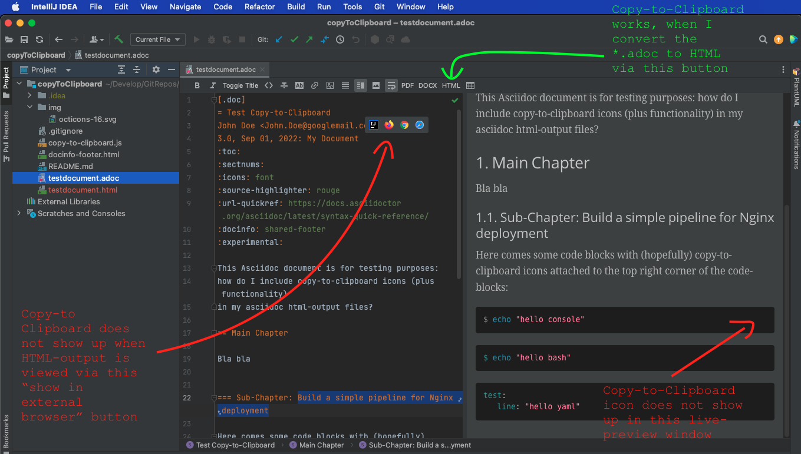
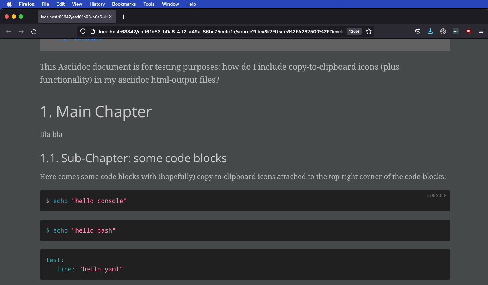
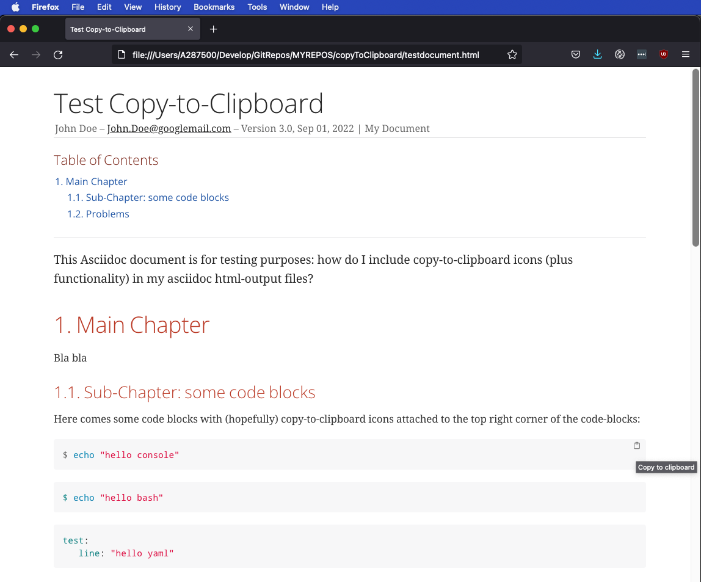

[.doc]
= Test Copy-to-Clipboard
John Doe <John.Doe@googlemail.com>
3.0, Sep 01, 2022: My Document
:toc:
:sectnums:
:icons: font
:source-highlighter: rouge
:url-quickref: https://docs.asciidoctor.org/asciidoc/latest/syntax-quick-reference/
:docinfo: shared-footer
:experimental:

This Asciidoc document is for testing purposes:
how do I include copy-to-clipboard icons (plus functionality)
in my asciidoc html-output files?

== Main Chapter

Bla bla

=== Sub-Chapter: some code blocks

Here comes some code blocks with (hopefully) copy-to-clipboard icons
attached to the top right corner of the code-blocks:

[source,console]
----
$ echo "hello console"
----

[source,bash]
----
$ echo "hello bash"
----

[source,yaml]
----
test:
   line: "hello yaml"
----

=== Problems

Here are some screenshots of my IntelliJ IDEA development environment and of Firefox.

==== Usecase 1: View the *.adoc in the preview-window.

The copy-to-clipboard icon does not appear in the preview-window
(provided by the asciidoctor-plugin) on the right hand side of
my IntelliJ-IDEA.

]

==== Usecase 2: View the *.adoc-preview in an external browser

The copy-to-clipboard icon does neither appear, when firefox is
started from  the IntelliJ-IDEA build-in external browser
button-bar.

(Is this, because the external browser  accesses the IntelliJ-internal
http-server  via http instead of https? )

==== Usecase 3: Convert *.adoc first, then open *.html on filesystem

But copy-to-clipboard works, if I convert the *.adoc first and then
open it in a browser (which happens in one step, if I press the
"HTML" Button in the menu bar of my IntelliJ's asciidoc-plugin-Editor)

I guess the reason is, that clipboard-functionality is (for
security reasons) only
available when the resulting HTML-output document is served
via https or opened directly on a local filesystem, right?

